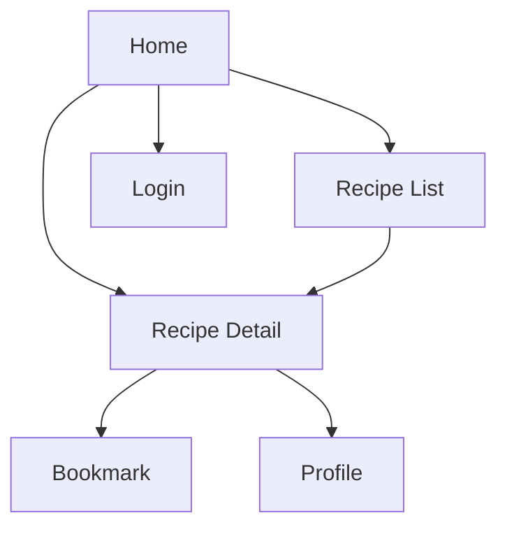

# Nusantara Kuno - MVP Simplified

## 1. Product Overview

Nusantara Kuno adalah platform digital sederhana untuk melestarikan resep masakan tradisional Indonesia. Fokus pada kualitas, bukan kuantitas - setiap resep dikurasi dan diverifikasi keasliannya.

**Target Audiens**: Diaspora Indonesia, food enthusiasts, dan generasi muda yang ingin belajar masakan tradisional.

**Proposisi Nilai**: Resep otentik dengan cerita budaya, bukan sekadar panduan memasak.

## 2. MVP Core Features (Fase 1)

### 2.1 User Roles - SIMPLIFIED

| Role    | Access              | Registration      |
| ------- | ------------------- | ----------------- |
| Visitor | 5 resep gratis      | Tidak perlu       |
| User    | 20 resep + bookmark | Email saja        |
| Premium | Semua resep + video | Langganan bulanan |

### 2.2 Essential Pages Only

1. **Home**: Hero + 6 resep unggulan + search
2. **Recipe List**: Grid sederhana dengan filter wilayah
3. **Recipe Detail**: Resep + cerita singkat + foto
4. **Profile**: Bookmark + progress sederhana
5. **Auth**: Login/register

### 2.3 MVP Features

| Page          | Feature          | Description                                        |
| ------------- | ---------------- | -------------------------------------------------- |
| Home          | Featured Recipes | 6 resep populer dengan foto menarik                |
| Home          | Simple Search    | Search by nama resep atau wilayah                  |
| Recipe List   | Basic Filter     | Filter: Semua, Jawa, Sumatra, Sulawesi, Kalimantan |
| Recipe List   | Recipe Cards     | Foto, nama, asal daerah, difficulty                |
| Recipe Detail | Recipe Info      | Bahan, langkah, tips, waktu masak                  |
| Recipe Detail | Cultural Story   | 1-2 paragraf cerita singkat                        |
| Recipe Detail | Actions          | Bookmark, share                                    |
| Profile       | Bookmarks        | Daftar resep yang di-bookmark                      |
| Profile       | Progress         | Jumlah resep yang sudah dicoba                     |

## 3. Simplified User Flow

**User Journey**:

1. Lihat 6 resep unggulan di home
2. Search atau browse by wilayah
3. Baca resep + cerita budaya
4. Bookmark favorit
5. Track progress di profile

## 4. KPI & Success Metrics

### 4.1 Primary KPIs (Bulan 1-3)

| Metric                 | Target                 | Measurement               |
| ---------------------- | ---------------------- | ------------------------- |
| **User Acquisition**   | 1,000 users            | Google Analytics          |
| **Recipe Engagement**  | 60% click-through rate | Recipe views/home visits  |
| **Bookmark Rate**      | 25% of recipe views    | Bookmarks/recipe views    |
| **Return Users**       | 40% weekly return      | GA cohort analysis        |
| **Premium Conversion** | 5% of active users     | Subscription/active users |

### 4.2 Secondary KPIs (Bulan 4-6)

| Metric                | Target                  | Measurement          |
| --------------------- | ----------------------- | -------------------- |
| **Content Quality**   | 4.5/5 avg rating        | User ratings         |
| **Search Success**    | 80% find what they want | Search → recipe view |
| **Mobile Usage**      | 70% mobile traffic      | Device analytics     |
| **Social Sharing**    | 15% share rate          | Shares/recipe views  |
| **Recipe Completion** | 30% try recipes         | User surveys         |

### 4.3 Business KPIs (Bulan 6+)

| Metric              | Target               | Measurement          |
| ------------------- | -------------------- | -------------------- |
| **Monthly Revenue** | $500                 | Subscription revenue |
| **Customer LTV**    | $24 (2 years)        | Revenue/customer     |
| **Churn Rate**      | <10% monthly         | Cancelled/total subs |
| **Content Growth**  | 10 new recipes/month | Recipe database      |

## 5. Testing Strategy

### 5.1 MVP Testing Plan

**Week 1-2: Core Functionality**

* [ ] Recipe display works on mobile/desktop

* [ ] Search returns relevant results

* [ ] Bookmark system functions

* [ ] User registration/login

* [ ] Payment flow (premium)

**Week 3-4: User Experience**

* [ ] Page load speed <3 seconds

* [ ] Mobile responsive design

* [ ] Recipe images load properly

* [ ] Navigation is intuitive

* [ ] Error handling works

**Week 5-6: Content Quality**

* [ ] Recipe accuracy verified

* [ ] Cultural stories fact-checked

* [ ] Photos are high quality

* [ ] Ingredient lists complete

* [ ] Cooking steps clear

### 5.2 User Testing

**Target Testers**: 20 users (10 diaspora, 10 local food enthusiasts)

**Test Scenarios**:

1. Find a Javanese recipe in under 2 minutes
2. Bookmark 3 recipes and find them later
3. Complete registration and upgrade to premium
4. Share a recipe on social media
5. Use search to find specific ingredients

**Success Criteria**:

* 80% complete tasks without help

* 4/5 average usability score

* <5% error rate

### 5.3 A/B Testing (Post-Launch)

**Test 1: Homepage Layout**

* A: 6 featured recipes in grid

* B: 3 featured + regional categories

* Metric: Click-through rate

**Test 2: Recipe Card Design**

* A: Photo + title + region

* B: Photo + title + difficulty + time

* Metric: Recipe page visits

**Test 3: Premium CTA**

* A: "Upgrade to Premium"

* B: "Unlock All Recipes"

* Metric: Conversion rate

## 6. Implementation Roadmap

### Phase 1: MVP (Month 1-2)

* Basic recipe database (50 recipes)

* Simple frontend (React + Supabase)

* User auth and bookmarks

* Mobile responsive

* Payment integration

### Phase 2: Content & Polish (Month 3-4)

* Add 50 more recipes

* Improve search functionality

* Add user ratings

* Performance optimization

* SEO implementation

### Phase 3: Growth Features (Month 5-6)

* Recipe recommendations

* Social sharing optimization

* Email newsletters

* Referral program

* Analytics dashboard

## 7. Success Criteria

**MVP Success = All of these achieved in 3 months:**

* ✅ 1,000 registered users

* ✅ 50 premium subscribers

* ✅ 4.0+ app store rating

* ✅ 60%+ recipe engagement rate

* ✅ Break-even on hosting costs

**Product-Market Fit Indicators:**

* Users return weekly to browse recipes

* Organic word-of-mouth growth

* Premium users stay >6 months

* Recipe completion rate >25%

* Social media mentions growing

## 8. Risk Mitigation

| Risk                    | Probability | Impact | Mitigation                           |
| ----------------------- | ----------- | ------ | ------------------------------------ |
| Low user adoption       | Medium      | High   | Focus on diaspora communities first  |
| Content quality issues  | Low         | High   | Strict curation process              |
| Technical problems      | Medium      | Medium | Simple tech stack, good testing      |
| Competition             | High        | Medium | Focus on authenticity differentiator |
| Monetization challenges | Medium      | High   | Start with proven freemium model     |

***

**Philosophy Applied**: "Simpel lebih baik dari kompleks"

* ✅ 5 pages instead of 8

* ✅ Clear, measurable KPIs

* ✅ Focused MVP scope

* ✅ Realistic testing plan

* ✅ Simple tech stack

* ✅ Achievable targets

