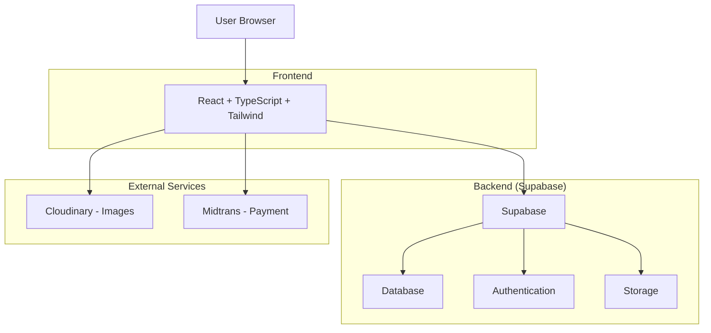

# Nusantara Kuno - MVP Technical Architecture

## 1. Simplified Architecture



## 2. MVP Tech Stack

**Frontend**:

* React 18 + TypeScript

* Tailwind CSS (styling)

* React Router (navigation)

* React Query (data fetching)

* Zustand (state management)

**Backend**:

* Supabase (database + auth + storage)

* PostgreSQL (via Supabase)

**External Services**:

* Cloudinary (image optimization)

* Midtrans (payment gateway)

* Vercel (hosting)

**Why This Stack?**

* ✅ Simple deployment

* ✅ Minimal configuration

* ✅ Built-in authentication

* ✅ Real-time capabilities

* ✅ Cost-effective for MVP

## 3. MVP Routes (5 Pages Only)

| Route         | Component        | Purpose                     |
| ------------- | ---------------- | --------------------------- |
| `/`           | HomePage         | Featured recipes + search   |
| `/recipes`    | RecipeListPage   | Browse recipes with filters |
| `/recipe/:id` | RecipeDetailPage | Recipe details + story      |
| `/profile`    | ProfilePage      | Bookmarks + progress        |
| `/auth`       | AuthPage         | Login/register              |

## 4. Simplified API Design

### 4.1 Core Endpoints (Supabase REST)

**Recipes**

```
GET /rest/v1/recipes
GET /rest/v1/recipes?select=*&region=eq.jawa
GET /rest/v1/recipes?select=*&id=eq.{id}
```

**User Bookmarks**

```
GET /rest/v1/user_bookmarks?user_id=eq.{user_id}
POST /rest/v1/user_bookmarks
DELETE /rest/v1/user_bookmarks?id=eq.{id}
```

**User Progress**

```
GET /rest/v1/user_progress?user_id=eq.{user_id}
POST /rest/v1/user_progress
```

### 4.2 Data Types

```typescript
// Core Types
interface Recipe {
  id: string;
  title: string;
  region: 'jawa' | 'sumatra' | 'sulawesi' | 'kalimantan' | 'other';
  difficulty: 'mudah' | 'sedang' | 'sulit';
  cooking_time: number; // minutes
  image_url: string;
  ingredients: string[];
  steps: string[];
  cultural_story: string;
  is_premium: boolean;
  created_at: string;
}

interface UserBookmark {
  id: string;
  user_id: string;
  recipe_id: string;
  created_at: string;
}

interface UserProgress {
  id: string;
  user_id: string;
  recipe_id: string;
  status: 'bookmarked' | 'attempted' | 'completed';
  rating?: number;
  created_at: string;
}
```

## 5. Database Schema (Simplified)

### 5.1 Tables

```sql
-- Recipes table
CREATE TABLE recipes (
  id UUID PRIMARY KEY DEFAULT gen_random_uuid(),
  title VARCHAR(200) NOT NULL,
  region VARCHAR(50) NOT NULL,
  difficulty VARCHAR(20) DEFAULT 'sedang',
  cooking_time INTEGER, -- minutes
  image_url TEXT,
  ingredients JSONB DEFAULT '[]',
  steps JSONB DEFAULT '[]',
  cultural_story TEXT,
  is_premium BOOLEAN DEFAULT false,
  created_at TIMESTAMP DEFAULT NOW()
);

-- User bookmarks
CREATE TABLE user_bookmarks (
  id UUID PRIMARY KEY DEFAULT gen_random_uuid(),
  user_id UUID REFERENCES auth.users(id) ON DELETE CASCADE,
  recipe_id UUID REFERENCES recipes(id) ON DELETE CASCADE,
  created_at TIMESTAMP DEFAULT NOW(),
  UNIQUE(user_id, recipe_id)
);

-- User progress
CREATE TABLE user_progress (
  id UUID PRIMARY KEY DEFAULT gen_random_uuid(),
  user_id UUID REFERENCES auth.users(id) ON DELETE CASCADE,
  recipe_id UUID REFERENCES recipes(id) ON DELETE CASCADE,
  status VARCHAR(20) DEFAULT 'attempted',
  rating INTEGER CHECK (rating >= 1 AND rating <= 5),
  created_at TIMESTAMP DEFAULT NOW(),
  UNIQUE(user_id, recipe_id)
);

-- User profiles (extends auth.users)
CREATE TABLE user_profiles (
  id UUID PRIMARY KEY REFERENCES auth.users(id) ON DELETE CASCADE,
  full_name VARCHAR(100),
  subscription_type VARCHAR(20) DEFAULT 'free',
  created_at TIMESTAMP DEFAULT NOW()
);
```

### 5.2 Row Level Security (RLS)

```sql
-- Enable RLS
ALTER TABLE user_bookmarks ENABLE ROW LEVEL SECURITY;
ALTER TABLE user_progress ENABLE ROW LEVEL SECURITY;
ALTER TABLE user_profiles ENABLE ROW LEVEL SECURITY;

-- Policies
CREATE POLICY "Users can manage own bookmarks" ON user_bookmarks
  FOR ALL USING (auth.uid() = user_id);

CREATE POLICY "Users can manage own progress" ON user_progress
  FOR ALL USING (auth.uid() = user_id);

CREATE POLICY "Users can manage own profile" ON user_profiles
  FOR ALL USING (auth.uid() = id);

-- Public read access for recipes
CREATE POLICY "Anyone can read recipes" ON recipes
  FOR SELECT USING (true);
```

### 5.3 Sample Data

```sql
-- Insert sample recipes
INSERT INTO recipes (title, region, difficulty, cooking_time, cultural_story, ingredients, steps) VALUES
('Gudeg Yogya', 'jawa', 'sulit', 180, 'Gudeg adalah makanan khas Yogyakarta yang memiliki cita rasa manis...', 
 '["Nangka muda 1 kg", "Santan kental 500ml", "Gula merah 200g"]',
 '["Potong nangka muda", "Rebus dengan santan", "Tambahkan bumbu halus"]'),

('Rendang Daging', 'sumatra', 'sulit', 240, 'Rendang adalah masakan tradisional Minangkabau yang telah diakui UNESCO...', 
 '["Daging sapi 1 kg", "Santan 1 liter", "Cabai merah 20 buah"]',
 '["Potong daging kotak", "Haluskan bumbu", "Masak hingga kering"]'),

('Soto Banjar', 'kalimantan', 'sedang', 60, 'Soto Banjar adalah kuliner khas Kalimantan Selatan...', 
 '["Ayam 1 ekor", "Kentang 3 buah", "Perkedel 5 buah"]',
 '["Rebus ayam", "Goreng kentang", "Sajikan dengan kuah"]');
```

## 6. Frontend Architecture

### 6.1 Folder Structure

```
src/
├── components/
│   ├── ui/           # Reusable UI components
│   ├── recipe/       # Recipe-specific components
│   └── layout/       # Layout components
├── pages/            # Page components
├── hooks/            # Custom React hooks
├── lib/              # Utilities and configs
├── types/            # TypeScript types
└── styles/           # Global styles
```

### 6.2 Key Components

```typescript
// components/recipe/RecipeCard.tsx
interface RecipeCardProps {
  recipe: Recipe;
  onBookmark?: (recipeId: string) => void;
}

// components/recipe/RecipeFilter.tsx
interface RecipeFilterProps {
  onFilterChange: (filters: FilterState) => void;
}

// hooks/useRecipes.ts
export function useRecipes(filters?: FilterState) {
  return useQuery({
    queryKey: ['recipes', filters],
    queryFn: () => fetchRecipes(filters)
  });
}

// hooks/useBookmarks.ts
export function useBookmarks() {
  const queryClient = useQueryClient();
  
  const addBookmark = useMutation({
    mutationFn: addBookmarkAPI,
    onSuccess: () => queryClient.invalidateQueries(['bookmarks'])
  });
  
  return { addBookmark };
}
```

## 7. Performance & Optimization

### 7.1 Image Optimization

* Use Cloudinary for automatic image optimization

* Lazy loading for recipe images

* WebP format with fallback

* Responsive images for different screen sizes

### 7.2 Data Loading

* React Query for caching and background updates

* Pagination for recipe lists (20 per page)

* Prefetch next page on scroll

* Optimistic updates for bookmarks

### 7.3 Bundle Optimization

* Code splitting by routes

* Tree shaking for unused code

* Compress images and assets

* Use Vite for fast builds

## 8. Testing Strategy

### 8.1 Unit Tests

```bash
# Test utilities and hooks
npm run test:unit

# Key test files:
# - hooks/useRecipes.test.ts
# - components/RecipeCard.test.tsx
# - utils/formatters.test.ts
```

### 8.2 Integration Tests

```bash
# Test user flows
npm run test:integration

# Key scenarios:
# - Recipe search and filter
# - Bookmark functionality
# - User authentication
# - Premium upgrade flow
```

### 8.3 E2E Tests (Playwright)

```typescript
// tests/recipe-flow.spec.ts
test('user can find and bookmark recipe', async ({ page }) => {
  await page.goto('/');
  await page.click('[data-testid="recipe-card-gudeg"]');
  await page.click('[data-testid="bookmark-button"]');
  await page.goto('/profile');
  await expect(page.locator('[data-testid="bookmarked-recipe"]')).toBeVisible();
});
```

## 9. Deployment & Monitoring

### 9.1 Deployment (Vercel)

```bash
# Auto-deploy on git push
git push origin main

# Environment variables:
# VITE_SUPABASE_URL
# VITE_SUPABASE_ANON_KEY
# VITE_MIDTRANS_CLIENT_KEY
```

### 9.2 Monitoring

* Vercel Analytics for performance

* Supabase Dashboard for database metrics

* Sentry for error tracking

* Google Analytics for user behavior

### 9.3 Backup & Security

* Supabase automatic backups

* Environment variables for secrets

* HTTPS by default

* RLS for data security

## 10. Development Workflow

### 10.1 Local Development

```bash
# Setup
npm install
npm run dev

# Database setup
npx supabase start
npx supabase db reset
```

### 10.2 Code Quality

```bash
# Linting and formatting
npm run lint
npm run format

# Type checking
npm run type-check

# Pre-commit hooks
npm run pre-commit
```

### 10.3 CI/CD Pipeline

```yaml
# .github/workflows/main.yml
name: CI/CD
on: [push, pull_request]
jobs:
  test:
    runs-on: ubuntu-latest
    steps:
      - uses: actions/checkout@v3
      - run: npm ci
      - run: npm run test
      - run: npm run build
```

***

**Simplified Architecture Benefits:**

* ✅ Single database (Supabase)

* ✅ No complex microservices

* ✅ Built-in authentication

* ✅ Real-time capabilities ready

* ✅ Easy to scale later

* ✅ Minimal DevOps overhead

* ✅ Fast development cycle

