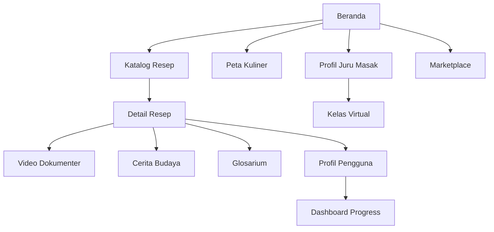

# Product Requirements Document - Nusantara Kuno

## 1. Product Overview

Nusantara Kuno adalah museum kuliner digital yang berfokus pada kurasi, pelestarian, dan pengajaran resep-resep masakan otentik dan warisan dari seluruh kepulauan Indonesia, terutama resep yang mulai jarang diketahui atau terancam punah.

Aplikasi ini menawarkan keaslian, kedalaman cerita, dan kualitas yang terkurasi secara profesional, berbeda dari aplikasi resep konvensional yang didominasi konten buatan pengguna. Target pasar adalah foodies, diaspora Indonesia, dan generasi muda yang ingin terhubung dengan akar budaya melalui gastronomi.

Produk ini memiliki potensi evergreen karena terikat erat dengan identitas, warisan, dan nostalgia, serta berperan penting dalam pelestarian warisan budaya tak benda Indonesia secara digital.

## 2. Core Features

### 2.1 User Roles

| Role | Registration Method | Core Permissions |
|------|---------------------|------------------|
| Pengunjung | Tanpa registrasi | Dapat melihat resep gratis terbatas dan konten preview |
| Pengguna Gratis | Email registration | Akses ke koleksi resep populer dan fitur dasar |
| Pengguna Premium (Pusaka Rasa) | Upgrade berlangganan | Akses penuh ke semua resep, video dokumenter, dan konten eksklusif |
| Admin/Kurator | Undangan khusus | Mengelola konten, verifikasi resep, dan moderasi |

### 2.2 Feature Module

Aplikasi Nusantara Kuno terdiri dari halaman-halaman utama berikut:

1. **Beranda**: hero section dengan featured recipes, navigasi wilayah, dan kategori kuliner
2. **Katalog Resep**: database resep terkurasi berdasarkan wilayah geografis dan jenis masakan
3. **Detail Resep**: informasi lengkap resep, video dokumenter, dan cerita di balik resep
4. **Glosarium**: direktori bumbu lokal dan teknik memasak tradisional
5. **Profil Juru Masak**: informasi maestro kuliner dan sejarawan kuliner
6. **Kelas Virtual**: platform pembelajaran interaktif dengan chef dan maestro
7. **Marketplace**: e-commerce bumbu dan bahan otentik
8. **Profil Pengguna**: progress pembelajaran, lencana, dan riwayat resep

### 2.3 Page Details

| Page Name | Module Name | Feature Description |
|-----------|-------------|---------------------|
| Beranda | Hero Section | Tampilkan resep unggulan dengan rotasi otomatis, search bar, dan navigasi cepat ke wilayah |
| Beranda | Peta Kuliner | Interactive map Indonesia dengan hotspot kuliner daerah dan akses cepat ke resep khas |
| Beranda | Kategori Populer | Grid kategori masakan (lauk, sayur, kue tradisional) dengan thumbnail menarik |
| Katalog Resep | Filter & Search | Filter berdasarkan wilayah, tingkat kesulitan, waktu memasak, dan bahan utama |
| Katalog Resep | Grid Resep | Tampilan card resep dengan foto, nama, asal daerah, dan status premium/gratis |
| Detail Resep | Informasi Resep | Bahan, langkah memasak, tips, dan tingkat kesulitan dengan estimasi waktu |
| Detail Resep | Video Dokumenter | Video gaya dokumenter menampilkan juru masak asli dan teknik tradisional |
| Detail Resep | Cerita Budaya | Artikel naratif tentang sejarah hidangan, makna budaya, dan penggunaan dalam upacara adat |
| Detail Resep | Interaksi | Bookmark resep, rating, dan share ke media sosial |
| Glosarium | Direktori Bumbu | Database visual bumbu lokal dengan foto, nama daerah, dan penjelasan penggunaan |
| Glosarium | Teknik Memasak | Panduan teknik tradisional seperti mengasap, membakar dalam bambu, dan fermentasi |
| Profil Juru Masak | Bio Maestro | Profil lengkap juru masak, latar belakang, dan spesialisasi kuliner daerah |
| Profil Juru Masak | Koleksi Resep | Daftar resep yang dikurasi oleh maestro tertentu |
| Kelas Virtual | Jadwal Kelas | Kalender kelas memasak virtual dengan chef dan maestro kuliner |
| Kelas Virtual | Live Streaming | Platform video call terintegrasi untuk pembelajaran interaktif |
| Marketplace | Katalog Produk | Daftar bumbu dan bahan otentik dengan deskripsi dan asal daerah |
| Marketplace | Keranjang & Checkout | Sistem pembelian terintegrasi dengan payment gateway lokal |
| Profil Pengguna | Dashboard | Progress pembelajaran, statistik resep yang dicoba, dan achievement |
| Profil Pengguna | Gamifikasi | Sistem lencana digital, level pengguna, dan leaderboard komunitas |

## 3. Core Process

### Alur Pengguna Umum:
1. Pengguna mengakses beranda dan menjelajahi peta kuliner Indonesia
2. Memilih wilayah atau kategori masakan yang diminati
3. Melihat katalog resep dengan filter sesuai preferensi
4. Membaca detail resep, menonton video dokumenter, dan mempelajari cerita budaya
5. Mengakses glosarium untuk memahami bumbu dan teknik yang tidak familiar
6. Menyimpan resep favorit dan melacak progress pembelajaran

### Alur Pengguna Premium:
1. Upgrade ke langganan "Pusaka Rasa" untuk akses penuh
2. Mengikuti kelas virtual dengan maestro kuliner
3. Mengakses resep langka dan konten eksklusif
4. Berbelanja bumbu otentik melalui marketplace terintegrasi
5. Berpartisipasi dalam program gamifikasi dan komunitas

## 4. User Interface Design

### 4.1 Design Style

- **Warna Utama**: Coklat tanah (#8B4513) dan emas (#FFD700) untuk mencerminkan kehangatan tradisional
- **Warna Sekunder**: Hijau daun (#228B22) dan krem (#F5F5DC) untuk nuansa natural Indonesia
- **Gaya Tombol**: Rounded corners dengan efek shadow halus, menggunakan warna emas untuk CTA utama
- **Font**: Kombinasi serif untuk heading (mencerminkan tradisi) dan sans-serif untuk body text (keterbacaan)
- **Layout**: Card-based design dengan grid responsif, top navigation dengan mega menu
- **Icon Style**: Outline icons dengan sentuhan tradisional Indonesia, emoji makanan untuk kategori

### 4.2 Page Design Overview

| Page Name | Module Name | UI Elements |
|-----------|-------------|-------------|
| Beranda | Hero Section | Full-width carousel dengan overlay text, gradient coklat ke emas, CTA button prominent |
| Beranda | Peta Kuliner | Interactive SVG map Indonesia dengan hover effects, color-coded regions |
| Katalog Resep | Grid Layout | 3-column grid desktop, 1-column mobile, card shadows, premium badge overlay |
| Detail Resep | Video Player | Custom video player dengan traditional Indonesian border design |
| Detail Resep | Content Layout | Two-column layout: resep di kiri, cerita budaya di kanan dengan scroll sync |
| Glosarium | Search Interface | Autocomplete search dengan filter alphabet, visual grid dengan hover zoom |
| Marketplace | Product Cards | E-commerce style cards dengan rating stars, price tags, dan quick add button |
| Profil Pengguna | Dashboard | Progress bars dengan traditional Indonesian patterns, achievement badges |

### 4.3 Responsiveness

Aplikasi dirancang mobile-first dengan adaptasi desktop. Optimasi touch interaction untuk mobile users, dengan gesture swipe untuk navigasi carousel dan infinite scroll untuk katalog resep. Breakpoints: 320px (mobile), 768px (tablet), 1024px (desktop).

