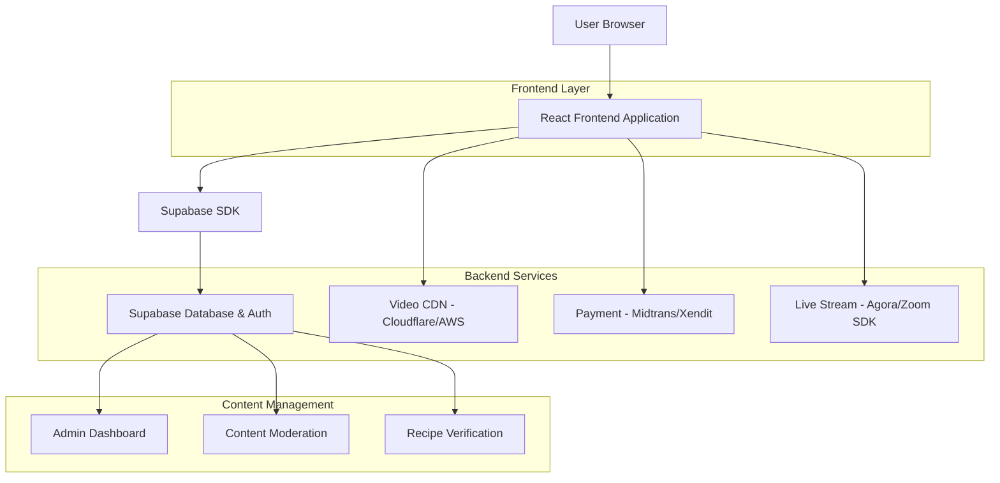
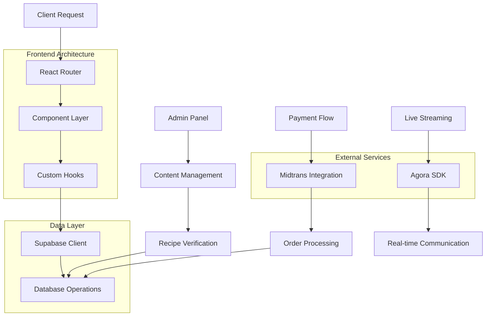
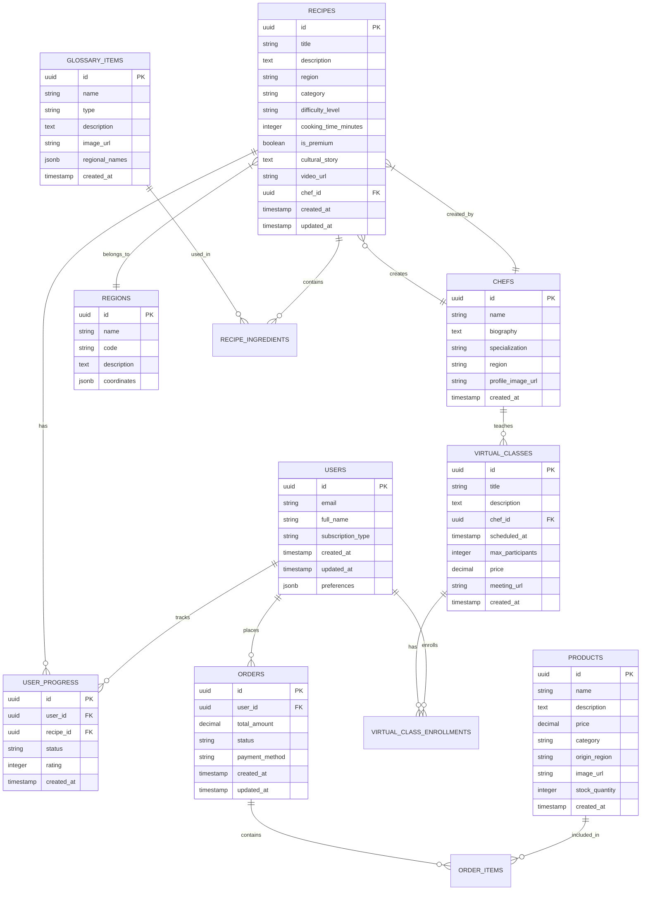

# Technical Architecture Document - Nusantara Kuno

## 1. Architecture Design



## 2. Technology Description

* **Frontend**: React\@18 + TypeScript + Tailwind CSS + Vite

* **Backend**: Supabase (Database, Authentication, Storage)

* **Video Streaming**: Cloudflare Stream atau AWS CloudFront

* **Payment**: Midtrans (Indonesia-focused payment gateway)

* **Live Streaming**: Agora.io SDK untuk kelas virtual

* **Maps**: Leaflet.js dengan custom Indonesia map tiles

* **State Management**: Zustand untuk state management ringan

* **UI Components**: Headless UI + Custom components

## 3. Route Definitions

| Route                | Purpose                                                |
| -------------------- | ------------------------------------------------------ |
| /                    | Beranda dengan hero section dan peta kuliner Indonesia |
| /resep               | Katalog resep dengan filter wilayah dan kategori       |
| /resep/:id           | Detail resep dengan video dokumenter dan cerita budaya |
| /glosarium           | Direktori bumbu dan teknik memasak tradisional         |
| /glosarium/:type/:id | Detail bumbu atau teknik spesifik                      |
| /juru-masak          | Daftar profil maestro kuliner dan sejarawan            |
| /juru-masak/:id      | Profil detail juru masak dan koleksi resepnya          |
| /kelas-virtual       | Jadwal dan daftar kelas memasak virtual                |
| /kelas-virtual/:id   | Room kelas virtual dengan live streaming               |
| /marketplace         | E-commerce bumbu dan bahan otentik                     |
| /marketplace/cart    | Keranjang belanja dan checkout                         |
| /profil              | Dashboard pengguna dengan progress dan achievement     |
| /langganan           | Halaman upgrade ke premium "Pusaka Rasa"               |
| /auth/login          | Halaman login dan registrasi                           |
| /admin               | Dashboard admin untuk content management               |

## 4. API Definitions

### 4.1 Core API

**Authentication (Supabase Auth)**

```
POST /auth/v1/signup
POST /auth/v1/token
POST /auth/v1/logout
```

**Recipe Management**

```
GET /rest/v1/recipes
```

Request Parameters:

| Param Name  | Param Type | isRequired | Description                                                 |
| ----------- | ---------- | ---------- | ----------------------------------------------------------- |
| region      | string     | false      | Filter berdasarkan wilayah (jawa, sumatra, kalimantan, etc) |
| category    | string     | false      | Kategori masakan (lauk, sayur, kue, minuman)                |
| difficulty  | string     | false      | Tingkat kesulitan (mudah, sedang, sulit)                    |
| is\_premium | boolean    | false      | Filter resep premium                                        |
| limit       | number     | false      | Jumlah resep per halaman (default: 20)                      |
| offset      | number     | false      | Offset untuk pagination                                     |

Response:

| Param Name | Param Type | Description                         |
| ---------- | ---------- | ----------------------------------- |
| data       | array      | Array resep dengan metadata lengkap |
| count      | number     | Total jumlah resep                  |
| has\_more  | boolean    | Indikator ada data selanjutnya      |

**Recipe Detail**

```
GET /rest/v1/recipes/:id
```

Response includes: ingredients, steps, cultural\_story, video\_url, chef\_profile, difficulty\_level, cooking\_time

**Glossary API**

```
GET /rest/v1/glossary
```

Request Parameters:

| Param Name | Param Type | isRequired | Description                         |
| ---------- | ---------- | ---------- | ----------------------------------- |
| type       | string     | false      | Type: 'ingredient' atau 'technique' |
| search     | string     | false      | Search term untuk nama bumbu/teknik |

**User Progress Tracking**

```
POST /rest/v1/user_progress
```

Request:

| Param Name | Param Type | isRequired | Description                                    |
| ---------- | ---------- | ---------- | ---------------------------------------------- |
| recipe\_id | uuid       | true       | ID resep yang dicoba                           |
| status     | string     | true       | Status: 'bookmarked', 'attempted', 'completed' |
| rating     | number     | false      | Rating 1-5 untuk resep                         |

**Virtual Class API**

```
GET /rest/v1/virtual_classes
POST /rest/v1/virtual_classes/:id/join
```

**Marketplace API**

```
GET /rest/v1/products
POST /rest/v1/orders
GET /rest/v1/orders/:id/status
```

## 5. Server Architecture Diagram



## 6. Data Model

### 6.1 Data Model Definition



### 6.2 Data Definition Language

**Users Table**

```sql
-- Create users table (extends Supabase auth.users)
CREATE TABLE public.users (
    id UUID PRIMARY KEY REFERENCES auth.users(id) ON DELETE CASCADE,
    email VARCHAR(255) UNIQUE NOT NULL,
    full_name VARCHAR(100) NOT NULL,
    subscription_type VARCHAR(20) DEFAULT 'free' CHECK (subscription_type IN ('free', 'premium')),
    preferences JSONB DEFAULT '{}',
    created_at TIMESTAMP WITH TIME ZONE DEFAULT NOW(),
    updated_at TIMESTAMP WITH TIME ZONE DEFAULT NOW()
);

-- Enable RLS
ALTER TABLE public.users ENABLE ROW LEVEL SECURITY;

-- Create policies
CREATE POLICY "Users can view own profile" ON public.users
    FOR SELECT USING (auth.uid() = id);

CREATE POLICY "Users can update own profile" ON public.users
    FOR UPDATE USING (auth.uid() = id);

-- Grant permissions
GRANT SELECT ON public.users TO anon;
GRANT ALL PRIVILEGES ON public.users TO authenticated;
```

**Regions Table**

```sql
CREATE TABLE public.regions (
    id UUID PRIMARY KEY DEFAULT gen_random_uuid(),
    name VARCHAR(100) NOT NULL,
    code VARCHAR(10) UNIQUE NOT NULL,
    description TEXT,
    coordinates JSONB,
    created_at TIMESTAMP WITH TIME ZONE DEFAULT NOW()
);

-- Insert initial data
INSERT INTO public.regions (name, code, description) VALUES
('Jawa', 'JW', 'Pulau Jawa dengan kekayaan kuliner seperti Gudeg, Rawon, dan Gado-gado'),
('Sumatra', 'SM', 'Sumatra dengan masakan pedas khas seperti Rendang dan Gulai'),
('Kalimantan', 'KL', 'Kalimantan dengan kuliner unik seperti Soto Banjar dan Amplang'),
('Sulawesi', 'SL', 'Sulawesi dengan cita rasa khas seperti Coto Makassar dan Tinutuan'),
('Papua', 'PP', 'Papua dengan kuliner tradisional seperti Papeda dan Ikan Bakar'),
('Nusa Tenggara', 'NT', 'Nusa Tenggara dengan masakan khas seperti Ayam Taliwang dan Se''i');

GRANT SELECT ON public.regions TO anon;
GRANT ALL PRIVILEGES ON public.regions TO authenticated;
```

**Chefs Table**

```sql
CREATE TABLE public.chefs (
    id UUID PRIMARY KEY DEFAULT gen_random_uuid(),
    name VARCHAR(100) NOT NULL,
    biography TEXT,
    specialization VARCHAR(100),
    region VARCHAR(50),
    profile_image_url TEXT,
    created_at TIMESTAMP WITH TIME ZONE DEFAULT NOW()
);

-- Sample data
INSERT INTO public.chefs (name, biography, specialization, region) VALUES
('Mbah Lindu', 'Maestro kuliner Jawa dengan pengalaman 40 tahun dalam masakan tradisional', 'Masakan Jawa Tradisional', 'Yogyakarta'),
('Nek Rohaya', 'Ahli kuliner Sumatra yang melestarikan resep-resep kuno keluarga', 'Masakan Padang Otentik', 'Padang'),
('Pak Usman', 'Juru masak Banjar yang menguasai teknik memasak tradisional Kalimantan', 'Kuliner Banjar', 'Banjarmasin');

GRANT SELECT ON public.chefs TO anon;
GRANT ALL PRIVILEGES ON public.chefs TO authenticated;
```

**Recipes Table**

```sql
CREATE TABLE public.recipes (
    id UUID PRIMARY KEY DEFAULT gen_random_uuid(),
    title VARCHAR(200) NOT NULL,
    description TEXT,
    region VARCHAR(50) NOT NULL,
    category VARCHAR(50) NOT NULL CHECK (category IN ('lauk', 'sayur', 'kue', 'minuman', 'sambal')),
    difficulty_level VARCHAR(20) DEFAULT 'sedang' CHECK (difficulty_level IN ('mudah', 'sedang', 'sulit')),
    cooking_time_minutes INTEGER,
    is_premium BOOLEAN DEFAULT false,
    cultural_story TEXT,
    video_url TEXT,
    chef_id UUID REFERENCES public.chefs(id),
    ingredients JSONB DEFAULT '[]',
    cooking_steps JSONB DEFAULT '[]',
    created_at TIMESTAMP WITH TIME ZONE DEFAULT NOW(),
    updated_at TIMESTAMP WITH TIME ZONE DEFAULT NOW()
);

-- Create indexes
CREATE INDEX idx_recipes_region ON public.recipes(region);
CREATE INDEX idx_recipes_category ON public.recipes(category);
CREATE INDEX idx_recipes_premium ON public.recipes(is_premium);
CREATE INDEX idx_recipes_chef ON public.recipes(chef_id);

-- Sample data
INSERT INTO public.recipes (title, description, region, category, difficulty_level, cooking_time_minutes, cultural_story, chef_id) VALUES
('Gudeg Yogya Asli', 'Gudeg tradisional Yogyakarta dengan cita rasa manis khas keraton', 'Yogyakarta', 'lauk', 'sulit', 180, 'Gudeg merupakan makanan khas Yogyakarta yang konon berasal dari zaman Kerajaan Mataram...', (SELECT id FROM public.chefs WHERE name = 'Mbah Lindu')),
('Rendang Daging Sapi', 'Rendang otentik Minangkabau dengan bumbu rempah lengkap', 'Sumatra Barat', 'lauk', 'sulit', 240, 'Rendang adalah masakan tradisional Minangkabau yang telah diakui UNESCO...', (SELECT id FROM public.chefs WHERE name = 'Nek Rohaya'));

GRANT SELECT ON public.recipes TO anon;
GRANT ALL PRIVILEGES ON public.recipes TO authenticated;
```

**Glossary Items Table**

```sql
CREATE TABLE public.glossary_items (
    id UUID PRIMARY KEY DEFAULT gen_random_uuid(),
    name VARCHAR(100) NOT NULL,
    type VARCHAR(20) NOT NULL CHECK (type IN ('ingredient', 'technique')),
    description TEXT,
    image_url TEXT,
    regional_names JSONB DEFAULT '{}',
    created_at TIMESTAMP WITH TIME ZONE DEFAULT NOW()
);

-- Sample data
INSERT INTO public.glossary_items (name, type, description, regional_names) VALUES
('Kluwek', 'ingredient', 'Buah kluwek atau keluak adalah biji dari buah pohon kepayang yang digunakan sebagai bumbu masakan', '{"jawa": "kluwek", "betawi": "keluak"}'),
('Andaliman', 'ingredient', 'Rempah khas Batak yang memberikan sensasi kesemutan di lidah', '{"batak": "andaliman", "indonesia": "merica batak"}'),
('Tumis', 'technique', 'Teknik memasak dengan menggunakan sedikit minyak dan api besar', '{}');

GRANT SELECT ON public.glossary_items TO anon;
GRANT ALL PRIVILEGES ON public.glossary_items TO authenticated;
```

**User Progress Table**

```sql
CREATE TABLE public.user_progress (
    id UUID PRIMARY KEY DEFAULT gen_random_uuid(),
    user_id UUID REFERENCES public.users(id) ON DELETE CASCADE,
    recipe_id UUID REFERENCES public.recipes(id) ON DELETE CASCADE,
    status VARCHAR(20) NOT NULL CHECK (status IN ('bookmarked', 'attempted', 'completed')),
    rating INTEGER CHECK (rating >= 1 AND rating <= 5),
    notes TEXT,
    created_at TIMESTAMP WITH TIME ZONE DEFAULT NOW(),
    updated_at TIMESTAMP WITH TIME ZONE DEFAULT NOW(),
    UNIQUE(user_id, recipe_id)
);

-- Create indexes
CREATE INDEX idx_user_progress_user ON public.user_progress(user_id);
CREATE INDEX idx_user_progress_recipe ON public.user_progress(recipe_id);

-- Enable RLS
ALTER TABLE public.user_progress ENABLE ROW LEVEL SECURITY;

CREATE POLICY "Users can manage own progress" ON public.user_progress
    FOR ALL USING (auth.uid() = user_id);

GRANT ALL PRIVILEGES ON public.user_progress TO authenticated;
```

